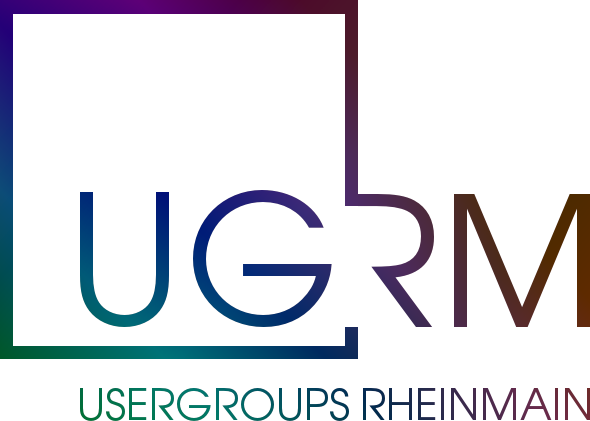

# Liste der Technologie-Usergroups in RheinMain

1. [Frankfurt Agile Community](./usergroup/agile-community.md)
1. [Agile Rhein-Main](./usergroup/agilerheinmain.md)
1. [Agiler Stammtisch Frankfurt](./usergroup/agilerstammtischffm.md)
1. [Apple-Talk Frankfurt](./usergroup/appletalk.md)
1. [ARIS User Group Deutschland](./usergroup/aris.md)
1. [Atlassian User Group Rhein-Main](./usergroup/aug.md)
1. [Computer-Stammtisch der RG 600 - Frankfurt/Rhein-Main](./usergroup/auge.md)
1. [BarCamp RheinMain](./usergroup/bcrm.md)
1. [Bitcoin Frankfurt](./usergroup/bitcoinffm.md)
1. [Cassandra Frankfurt](./usergroup/cassandra.md)
1. [Chaos Darmstadt](./usergroup/cccda.md)
1. [Chaos Computer Club Frankfurt e.V.](./usergroup/cccffm.md)
1. [Chaos Computer Club Mainz / Wiesbaden](./usergroup/cccmzwi.md)
1. [Ceph Frankfurt](./usergroup/ceph.md)
1. [Clojure Users Group Frankfurt am Main](./usergroup/cljugf.md)
1. [CocoaHeads Frankfurt](./usergroup/cocoaheads.md)
1. [Linux User Group Darmstadt](./usergroup/dalug.md)
1. [DevOps Frankfurt](./usergroup/devops.md)
1. [Django Users Darmstadt](./usergroup/djangoda.md)
1. [Digital Media Women Frankfurt](./usergroup/dmwFFM.md)
1. [.NET User Group Frankfurt/Main](./usergroup/dnugffm.md)
1. [Docker Frankfurt](./usergroup/docker.md)
1. [Donnerstalk im Heimathafen Wiesbaden](./usergroup/donnerstalk.md)
1. [.NET Developers Group Frankfurt](./usergroup/dotnetdevsffm.md)
1. [Drupal User Group Rhein-Main](./usergroup/drupal.md)
1. [EdTech Rhein-Main](./usergroup/edtech.md)
1. [ElasticSearch User Group Frankfurt](./usergroup/elasticsearch.md)
1. [ExtJS User Group Frankfurt](./usergroup/extjs.md)
1. [Funkamateure DARC Ortsverband Frankfurt](./usergroup/f05.md)
1. [Freifunk Darmstadt](./usergroup/ffda.md)
1. [Cloud Frankfurt](./usergroup/ffmcloud.md)
1. [Freifunk Mainz](./usergroup/ffmz.md)
1. [Freifunk Wiesbaden](./usergroup/ffwi.md)
1. [Flashtreffen Frankfurt](./usergroup/flashtreffen.md)
1. [Projekt-Stammtisch Frankfurt](./usergroup/fprost.md)
1. [Frankfurt Developers](./usergroup/fradev.md)
1. [FrankfurtJS](./usergroup/frankfurtjs.md)
1. [OpenSolaris User Group Frankfurt Area](./usergroup/fraosug.md)
1. [Frankfurter Freiberufler-Stammtisch](./usergroup/freiberufler-frankfurt.md)
1. [Frontend Usergroup RheinMain](./usergroup/frontend.md)
1. [Free Software Foundation Europe Fellowship Rhein-Main](./usergroup/fsfe.md)
1. [TYPO3 User Group Frankfurt](./usergroup/ftug.md)
1. [Grosses Treffen aller Frankfurter Usergroups & Friends](./usergroup/fuxcon.md)
1. [Google Developer Group Rhein-Main](./usergroup/gdgrm.md)
1. [GI Rhein-Main](./usergroup/girheinmain.md)
1. [Frankfurt Gophers](./usergroup/go.md)
1. [Graph DB Frankfurt](./usergroup/graphdbffm.md)
1. [Hackerspace FFM](./usergroup/hackffm.md)
1. [Haskell User Group Frankfurt](./usergroup/haskell.md)
1. [Hosting-Stammtisch](./usergroup/hs.md)
1. [Hadoop User Group Rhein-Main](./usergroup/hugrheinmain.md)
1. [Linux User Group Hanau](./usergroup/hulug.md)
1. [InDesign User Group Rhein/Main](./usergroup/idugrm.md)
1. [Independent Game Developers Rhein-Main](./usergroup/igd.md)
1. [IoT Frankfurt](./usergroup/iotffm.md)
1. [IT-Stammtisch Darmstadt](./usergroup/itsda.md)
1. [Joomla! Forum Frankfurt/Rhein-Main](./usergroup/joomla.md)
1. [Java User Group Darmstadt](./usergroup/jugda.md)
1. [Java User Group Frankfurt](./usergroup/jugf.md)
1. [Lean Startup Circle Rhein-Main](./usergroup/leanstartupcircle.md)
1. [Linux User Group Bad Nauheim](./usergroup/lugbn.md)
1. [Linux User Group Frankfurt](./usergroup/lugffm.md)
1. [Limited WIP Society Rhein-Main](./usergroup/lwsrm.md)
1. [Magento Stammtisch Rhein-Main](./usergroup/magerm.md)
1. [Management 3.0 Stammtisch](./usergroup/management30.md)
1. [Micropreneurs am Main (Frankfurt)](./usergroup/micropreneurs.md)
1. [Microservices Meetup Rhein Main](./usergroup/microservicerm.md)
1. [Mobile Developer Group Ffm](./usergroup/mobiledevffm.md)
1. [Mobile Usergroup Frankfurt](./usergroup/mobileffm.md)
1. [MongoDB User Group Frankfurt Rhein-Main](./usergroup/mongodbfrm.md)
1. [Rhein Main Mobile Quality Crew](./usergroup/mqc.md)
1. [Neos Meetup Rhein/Main](./usergroup/neosrm.md)
1. [NODE+CODE (Processing Frankfurt)](./usergroup/nodeandcode.md)
1. [Darmstadt node.js](./usergroup/nodejsda.md)
1. [NoSQL Group Frankfurt](./usergroup/nosqlffm.md)
1. [Objektforum FFM](./usergroup/objektforumffm.md)
1. [OK Lab Frankfurt am Main](./usergroup/oklabffm.md)
1. [OpenStack MeetUp Frankfurt](./usergroup/openstack.md)
1. [OpenTechSchool RheinMain](./usergroup/opentechschool.md)
1. [Open Text Web Solutions Usergroup](./usergroup/opentext.md)
1. [ORACLE-Anwendergruppe e.V. Deutschland](./usergroup/oracle.md)
1. [Online-Stammtisch Frankfurt](./usergroup/osf.md)
1. [OSM-Stammtisch Frankfurter](./usergroup/osm.md)
1. [OpenSource || Share-alike Stammtisch Frankfurt](./usergroup/osstaffm.md)
1. [OWASP Stammtisch Frankfurt](./usergroup/owasp.md)
1. [PHP Usergroup Frankfurt am Main](./usergroup/phpugffm.md)
1. [PHP UG Rheinhessen](./usergroup/phpugrhh.md)
1. [Perl Mongers Frankfurt](./usergroup/pm.md)
1. [#PMFriends Onsite](./usergroup/pmfriends.md)
1. [Penguin User Group](./usergroup/pug.md)
1. [palmusergroup frankfurt](./usergroup/pugffm.md)
1. [Python Stammtisch Darmstadt](./usergroup/pystada.md)
1. [Python UserGroup RheinMain](./usergroup/pyugrm.md)
1. [R Users Group Wiesbaden](./usergroup/r.md)
1. [JavaScript User Group für Wiesbaden und Rhein-Main](./usergroup/rheinmainjs.md)
1. [Ruby on Rails Usergroup Rhein-Main](./usergroup/rugrm.md)
1. [Scala Enthusiasts](./usergroup/scala.md)
1. [#SchnitzelFFM](./usergroup/schnitzelffm.md)
1. [#SchnitzelOF](./usergroup/schnitzelof.md)
1. [SEM-Stammtisch-Frankfurt](./usergroup/sem.md)
1. [Symfony Usergroup Frankfurt am Main](./usergroup/sfugfra.md)
1. [Sharepoint Usergroup Frankfurt](./usergroup/sharepoint.md)
1. [Social Media Stammtisch Frankfurt](./usergroup/smffm.md)
1. [Software Architecture Meetup Frankfurt](./usergroup/softwarearchitecture.md)
1. [Software Test User Group Rhein Main](./usergroup/stugrm.md)
1. [Softwerkskammer Rhein-Main](./usergroup/swkrm.md)
1. [Techettes Frankfurt](./usergroup/techettes.md)
1. [TeX-Stammtisch Frankfurt](./usergroup/tex.md)
1. [Typostammtisch Offenbach](./usergroup/tpostmtshoff.md)
1. [TuXCamp – Das Linux-BarCamp](./usergroup/tuxcamp.md)
1. [Usability Testessen](./usergroup/usability-testessen.md)
1. [Vaadin Frankfurt](./usergroup/vaadin.md)
1. [Webdev Meetup Taunus](./usergroup/webdevtaunus.md)
1. [webgrrls Rhein-Main](./usergroup/webgrrls.md)
1. [Wikipedianer Frankfurt](./usergroup/wikipedia.md)
1. [Webmontag Frankfurt](./usergroup/wmfra.md)
1. [Workschoppe](./usergroup/workschoppe.md)
1. [WordPress Meetup Frankfurt](./usergroup/wpfra.md)
1. [WordPress UserGroup Frankfurt](./usergroup/wpugffm.md)
1. [Women Techmakers Frankfurt](./usergroup/wtm.md)
1. [XP User Group Frankfurt](./usergroup/xpugffm.md)
1. [YouTube Stammtisch RheinMain](./usergroup/youtube.md)
