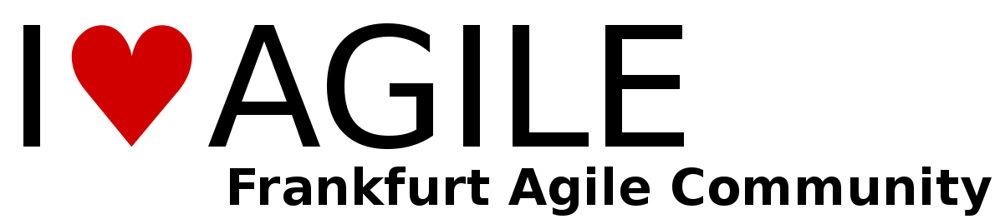

# Frankfurt Agile Community

The Agile Community group is open for the people who are interested in Agile methodology. As the
essence of agile is continuous improvement, by sharing the experience how we run agile during the work or live
we can get new ideas to keep up us in trend and also make the work and life colorful and easier. All people
interested in Agile, Scrum, Lean... just join the group and let's share!

## Links &amp; Kontakt

Homepage: <http://www.meetup.com/Frankfurt-Agile-Community-Meetup/>

