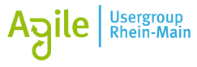

# Agile Rhein-Main

Die "Agile Rhein-Main" ist ein regionales Netzwerk mit den Interessengebieten: Agil, Scrum, agiles
Projektmanagement, agile Software-Entwicklung, Kanban, Lean Software Development, Agile Organisation etc.

## Links &amp; Kontakt

Homepage: <https://www.xing.com/net/pri4044d1x/agilerheinmain/>

