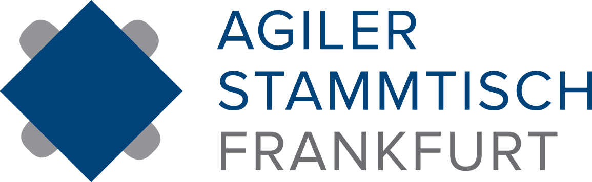

# Agiler Stammtisch Frankfurt

Austausch, Lernen und Erleben rund um die agilen Themen. 
Beim agilen Stammtisch stellen Speaker ihre agilen Themen und Erfahrungen vor - es wird aber auch der Fokus gelegt auf den gegenseitigen Austausch und das konkrete Erleben von agilen Methoden. 
Hierzu werden immer wieder agile Simulationen und Spiele vorgestellt, an denen die graue Theorie direkt ausprobiert werden kann. 
Jedes Event bietet außerdem genug Freiraum für den gemeinsamen Austausch.n.

Getränke und Snacks werden von codecentric AG gesponsert.

## Links &amp; Kontakt

Homepage: <https://www.meetup.com/de-DE/Agiler-Stammtisch-Frankfurt/>

Meetup: <http://www.meetup.com/de-DE/Agiler-Stammtisch-Frankfurt/>

