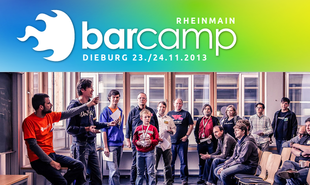

# BarCamp RheinMain (BCRM)

Ein BarCamp ist eine andere Form von Konferenz.
Im Gegensatz zu den gewöhnlichen Fachkonferenzen erfolgt der Wissensaustausch bei BarCamps unentgeltlich und
gegenseitig. Das heißt, es gibt keine designierten Sprecher, die Beiträge werden allesamt von den Besuchern
gestaltet und auch gehalten.

Auch eine Themenvorgabe wird bewusst vermieden, fachfremde Teilnehmer und Vorträge sind sogar erwünscht. Die
Organisatoren stellen lediglich Termin und Räumlichkeiten zur Verfügung, um alles andere kümmern sich die
Teilnehmer selbst.

## Links &amp; Kontakt

Homepage: <http://www.barcamp-rheinmain.de/>

E-Mail: [info@netzkultur-rheinmain.de](mailto:info@netzkultur-rheinmain.de)

Twitter: [@bc_rm](https://twitter.com/@bc_rm) [#bcrm13](https://twitter.com/search?q=%23bcrm13)

Facebook: <http://www.facebook.com/BarCampRheinMain>

Google+: <https://plus.google.com/u/0/106777532284423884475/posts>

