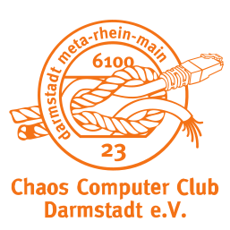

# Chaos Darmstadt

Chaos Darmstadt ist die örtliche Vertretung des Chaos in Darmstadt. Wir sind "ErfA"-Kreis des CCC und
eine Hochschulgruppe der TU Darmstadt. (Bei uns sind aber natürlich auch nicht studierende Personen herzlich
willkommen!) Im Rhein-Main-Gebiet fördern wir den Zusammenhalt und Erfahrungsaustausch der Computer- und
Chaostreffs (MetaRheinMain). Wir treffen uns jeden Dienstag ab 19:00 Uhr zum Open Chaos in unserem Hackspace 
	- aktueller Arbeitsname "W17" - im dritten Obergeschoss der Wilhelminenstraße 17 in 64283 Darmstadt. Für Anfahrtsbeschreibungen frage bitte den
Routingdienstleister deines geringsten Misstrauens. Falls du unsicher bist, ob der Raum offen ist, schau einfach auf unserer Webseite nach.

## Links &amp; Kontakt

Homepage: <https://chaos-darmstadt.de/>

Twitter: [@chaosdarmstadt](https://twitter.com/@chaosdarmstadt)

Mailingliste: <https://lists.darmstadt.ccc.de/mailman/listinfo/public>

