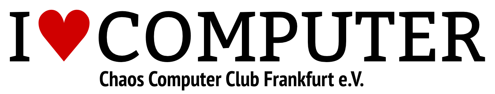

# Chaos Computer Club Frankfurt e.V. (CCCFFM)

Wir sind eine Gruppe von Leuten, die sich teilweise schon seit Jahren wöchentlich zum Meinungs-,
Erfahrungs- und Wissensaustausch treffen. Themen sind hierbei im Wesentlichen Computer und digitale
Kommunikation, Technik allgemein, gesellschaftliche Auswirkungen und Veränderungen hierdurch, Kunst, Kultur und
Bildung im technischen Umfeld, Spaß am Gerät (siehe dazu auch unsere Satzung).
Dazu treffen wir uns jeden Donnerstag öffentlich im Hackquarter wozu auch Nicht-Mitglieder jederzeit willkommen
sind – wir freuen uns immer über neue Leute! An anderen Tagen unternehmen wir auch schon mal spontan was in
kleineren Gruppen.
Seit November 2010 haben wir unseren eigenen Hackerspace (das Hackquarter) in der Kommunikationsfabrik. Hier
kann man zusammen löten, diskutieren, klönen, ohne daß man kurz nach Mitternacht nach Hause geschickt wird, und
kann z.B. während der Laufzeit von Projekten auch schon mal Sachen dort lassen.
Als Erfahrungsaustauschkreis (Erfa) des CCC e.V. pflegen wir auch den Austausch mit anderen Erfas, Chaostreffs
und Gruppen der Chaos-Familie, nehmen mehr oder weniger aktiv an vielen Chaos-Events teil und führen mit Anderen
aus der Region die jährlichen MetaRheinMain Chaosdays als Mitveranstalter durch. Für nähere Infos könnt Ihr uns
am besten im IRC besuchen oder an unserer Mailingliste teilnehmen. Oder Ihr kommt einfach mal donnerstags ins
Hackquarter.

## Links &amp; Kontakt

Homepage: <http://ccc-ffm.de/>

Twitter: [@cccffm](https://twitter.com/@cccffm)

Mailingliste: <http://lists.ccc-ffm.de/listinfo/public>

