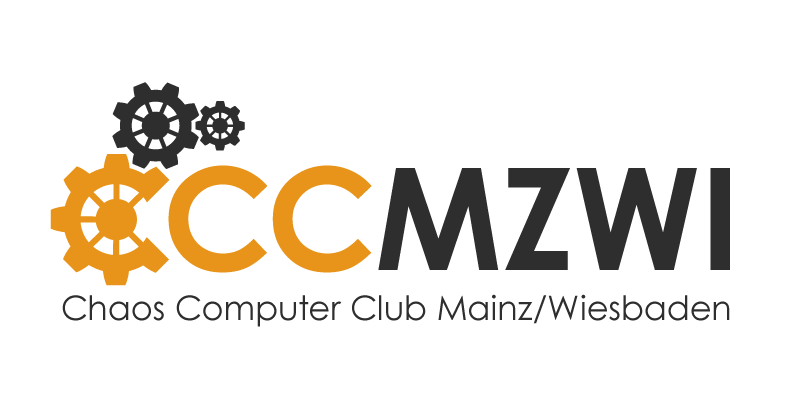

# Chaos Computer Club Mainz / Wiesbaden (CCCMZWI)

Unsere lockeren Treffen sind Basis für Projekte: Zusammen programmieren oder wilde Lötaktionen,
organisieren von Veranstaltungen oder Diskussionsrunden, planen neuer Projekte, die neusten Memes bequatschen…
alles das ist das Chaos. Durch diese Vielzahl von unterschiedlichen Aktivitäten trifft man immer wieder auf sehr
interessante Leute bei uns. Bei uns ist jeder herzlich willkommen, auch wenn er sich nicht den ganzen Tag mit
Computern auseinander setzt.

## Links &amp; Kontakt

Homepage: <http://www.cccmz.de/>

E-Mail: [kontakt@cccmz.de](mailto:kontakt@cccmz.de)

Twitter: [@cccmz](https://twitter.com/@cccmz) [#cccmz](https://twitter.com/search?q=%23cccmz)

Facebook: <https://www.facebook.com/cccmz>

Vielen Dank an [@miracula_de](https://twitter.com/miracula_de) für unser Logo.

