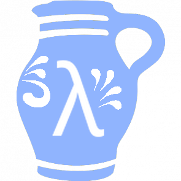

# Clojure Users Group Frankfurt am Main (CLJUGF)

Ziel dieser user group ist es die Sprache
Clojure im Speziellen, funktionale
Programmierung im Allgemeinen besser zu
verstehen. Hierzu planen wir ein sogenanntes
Coding Dojo. Das heißt, wir werden aktiv Code
schreiben.

Ferner planen wir theoretische und praktische
Vorträge zu interessanten Themen.
Beispielsweise auch von Entwicklern, die
Clojure bereits seit einiger Zeit einsetzen.
So ergibt sich die Möglichkeit zum
Erfahrungsaustausch aus erster Hand.

## Links &amp; Kontakt

Homepage: <http://kotka.de/cljugf.html>

E-Mail: [mb@kotka.de](mailto:mb@kotka.de)

Twitter: [@cljugf](https://twitter.com/@cljugf)

