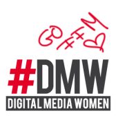

# Digital Media Women Frankfurt (DMWffm)

Die Digital Media Women (DMW) sind ein in Hamburg gegründetes Branchennetzwerk und seit Juli 2012 ein
eingetragener Verein. Wir arbeiten im und mit dem Netz: als Social Media Managerinnen, Web- und
Grafikdesignerinnen, Online-Journalistinnen, Bloggerinnen, Programmiererinnen und in vielen anderen Feldern des
World Wide Web. Unsere Arbeitsfelder sind oft Männerdomänen – doch wir wollen die Situation von Frauen in
unseren Berufen verbessern und unsere Expertise unter Beweis stellen.

Digital Media Women sind wissenshungrig und überzeugt, dass Wissen wächst, wenn man es teilt. Wir wollen stets
dazu lernen. Dafür reisen wir zu Barcamps oder Branchenkonferenzen wie der re:publica, besuchen Vorträge und
veranstalten selbst welche. Wir verstehen uns nicht bloß als passive Zuschauerinnen, wir wollen Impulse geben
und vorne mit dabei sein. Ein wichtiges Ziel der DMW ist, mehr Frauen auf die Podien der männerdominierten
Konferenzwelt zu bringen.

Allen Digital Media Women steht ein dichtes Netzwerk kompetenter Frauen offen. Wir bieten neue Kontakte und
Kommunikation auf professioneller Ebene – online und offline. Die DMW treffen sich, um gemeinsam berufliche
Projekte voranzutreiben, neuen Input zu erfahren, einander Tipps und Empfehlungen zu geben oder einfach nur zum
gemütlichen Austausch unter Gleichgesinnten. In der Community findest du geballte Kompetenz von inzwischen mehr
als 600 Frauen aus ganz Deutschland – und übrigens auch Männern, die unsere Anliegen unterstützen.

## Links &amp; Kontakt

Homepage: <http://www.digitalmediawomen.de/>

Twitter: [@DigiWomenDE](https://twitter.com/@DigiWomenDE) [#dmwFFM](https://twitter.com/search?q=%23dmwFFM)

Facebook: <https://www.facebook.com/DigitalMediaWomen>

