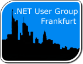

# .NET User Group Frankfurt/Main (DNUGFFM)

Die .NET User Group Frankfurt/Main beschäftig sich als freie, unabhängige und heterogene Gruppe mit der
.NET-Programmierung im Allgemeinen aber auch mit Produkten und Tools, die in diesem Umfeld existieren.

Im Vordergrund steht dabei der Austausch von technologischem Wissen und Erfahrungen. Diesen Know-How Transfer
versuchen wir in monatlichen Meetings, mit Vorträgen von Mitgliedern und namhaften Sprechern sowie mit
Diskussionen, zu realisieren.

Da bei uns jede .NET Programmiersprache (C#, VB.NET, IronPython, Powershell, etc.) sowie .NET Implementierung
(z.B Rotor, Mono) willkommen ist, sind wir auch offen für alles im .NET-Universum und laden alle Interessierten
dazu ein, Mitglied dieser Benutzergruppe zu werden.

## Links &amp; Kontakt

Homepage: <http://www.dotnet-usergroup.de/>

Twitter: [@dnugffm](https://twitter.com/@dnugffm)

