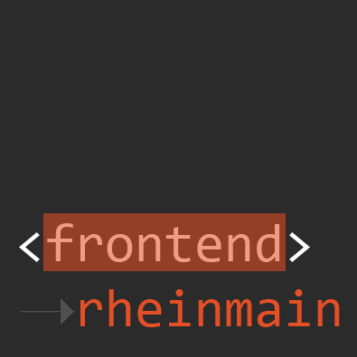

# Frontend Usergroup RheinMain

Frontend RheinMain ist der Community-Hub für Frontend-Entwickler im Rhein-Main-Gebiet. Dabei geht es um
Frontend-Kernthemen wie HTML(5), CSS(3), OOCSS-/BEM-Patterns, SASS, Webstandards, Responsive Design,
Accessibility, Arbeitsweisen, Kommunikation, Styleguides, Deployment etc pp. …

## Links &amp; Kontakt

Homepage: <http://frontend-rheinmain.de/>

Twitter: [@frontend_rm](https://twitter.com/@frontend_rm)

Logo: [@frontend_rm](https://twitter.com/frontend_rm)

