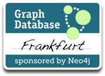

# Graph DB Frankfurt

Entwickler mit Interesse an Graph-Datenbanken, oder solche, die bereits mit Graph-Datenbanken arbeiten,
um soziale, geografische, hierarchische oder anderweitig hochgradig verknüpfte Daten zu verarbeiten.

Wir hosten praktische "Hands-on"-Sessions, diskutieren und beurteilen technische Lösungen, veranstalten
Themen-Vorträge, und natürlich kommt auch das Soziale nicht zu kurz, wenn wir beim gemeinsamen Bier unsere Köpfe
zusammenstecken.

Seid Ihr neugierig, was Graph-Datenbanken sind, und wollt Ihr Eure Fähigkeiten und Kenntnisse außerhalb von
relationalen Datenbanken erweitern? Dann seid Ihr hier richtig und solltet Euch uns anschließen!

## Links &amp; Kontakt

Homepage: <http://www.meetup.com/graphdb-frankfurt/>

