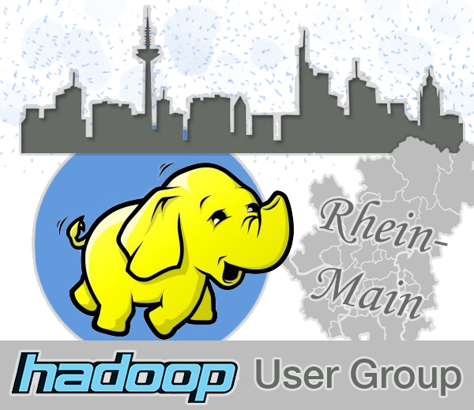

# Hadoop User Group Rhein-Main (HUG Rhein-Main)

Interessiert an Apache Hadoop und dem Ökosystem (Pig, Hive, HBase,
HCatalog, Ambari, ...)? Oder schon Erfahrungen mit Hadoop gesammelt? Oder sogar
schon ein Hadoop-Ninja? Und dazu noch in der schönen Rhein-Main-Region unterwegs?
Dann ist diese Gruppe genau der richtige Ort, um andere Hadoop-Verrückte
kennenzulernen, mehr über Hadoop zu lernen, inspirierende Vortrag anzuhören, mit
großartigen Menschen zu diskutieren und zusammen eine lebendige Community zu
bilden. Wir werden uns regelmäßig alle zwei Monate an verschiedenen Locations in
in der Rhein-Main-Region treffen. Falls du Interesse daran hast ein zukünftiges
Treffen zu hosten oder einen Vortrag halten willst, gib uns bitte einfach kurz
Bescheid...

## Links &amp; Kontakt

Homepage: <http://www.meetup.com/HUG-Rhein-Main/>

