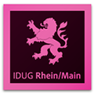

# InDesign User Group Rhein/Main (IDUGRM)

Die Indesign User Group RheinMain, kurz IDUG RheinMain, ist eine seit Februar 2011 bestehende und
ständig wachsende Community, die sich gerne und am liebsten in lockerer Atmosphäre mit InDesign und allen
spannenden Themen rund um die Publishing-Szene beschäftigt.

Mindestens 4-5 Mal im Jahr finden kostenlos Veranstaltungen von Anwendern für Anwender in ausgesuchten und
wechselnden Locations statt. Wir bieten interessante Fachvorträge auf stets hohem Niveau. Die Referenten kommen
aus den eigenen Reihen, Firmen oder Organisationen.

Es gibt jedes mal eine Verlosung mit wertvollen Preisen, etwas für den Gaumen und jede Menge netter Leute, mit
denen man sich in der Pause oder auch anschließend beim get-together austauschen kann.

## Links &amp; Kontakt

Homepage: <http://www.idug-rm.de/>

Twitter: [@idugrheinmain](https://twitter.com/@idugrheinmain)

Facebook: <http://www.facebook.com/idugrm>

