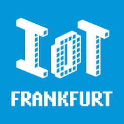

# IoT Frankfurt

        IoT enthusiasts of Frankfurt unite!

        IoT Frankfurt steht allen offen, die an der Entwicklung des Internet of Things teilhaben wollen – als Teilnehmer, Beobachter oder teilnehmende Beobachter. In regelmäßigen Abendveranstaltungen möchten wir diesen neuen, spannenden Industriezweig gemeinsam und interdisziplinär erkunden – in Form von Vorträgen, Hackathons, Diskussionsrunden und mehr.

        Hype, Wirtschaftsmotor, Innovationstreiber, technische Spielerei: Das Internet of Things (IoT) bedeutet für jeden etwas anderes. Aber wir alle beobachten die zunehmende Verbreitung vernetzter, intelligenter Geräte und Alltagsgegenstände in unserem Umfeld. Seit Kevin Ashton den Begriff „Internet of Things“ 1999 prägte, wird aus der einstigen Utopie, dass Computer, Sensoren und Aktoren selbständig Daten austauschen und einander steuern können, Stück für Stück Realität. Auch die Konjunktur verwandter Begriffe wie Industrie 4.0, M2M oder Internet of Everything spricht dafür. So entdecken viele Traditionsunternehmen im IoT einen Jungbrunnen, während sich junge Startups zu innovativen Geschäftsideen inspirieren lassen.
    

## Links &amp; Kontakt

Homepage: <http://www.meetup.com/de/IoT-Frankfurt/>

