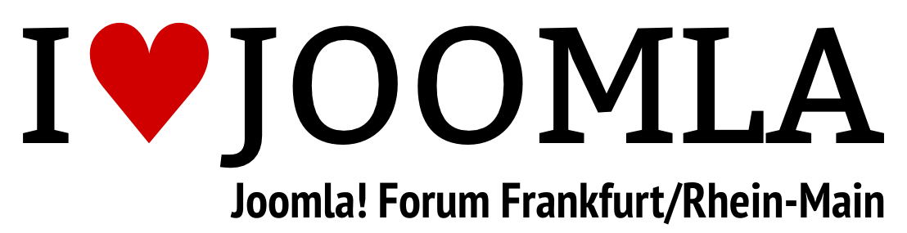

# Joomla! Forum Frankfurt/Rhein-Main

Networking, Erfahrungsaustausch, gegenseitige Hilfe und gemmeinsame Projekte - das Joomla! Forum
Frankfurt / Rhein-Main ist die zentrale Plattform für Joomla-Anwender im Rhein-Main-Gebiet.
Neben den persönlichen Treffen möchte die JUG FFM auch zur Imageförderung von Joomla beitragen.
Die JUG FFM läd alle Joomla!-User und solche, die es erst noch werden möchten, zum Gedankenaustausch ein. Im
Joomla! Forum Frankfurt
/ Rhein-Main treffen sich Webentwickler, Webdesigner, Programmierer und Endanwender, die beruflich oder privat
mit dem Joomla! CMS arbeiten.

## Links &amp; Kontakt

Homepage: <http://www.joomla-rhein-main.de/>

