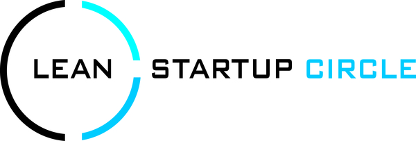

# Lean Startup Circle Rhein-Main

Der Lean Startup Circle Rhein-Main ist eine Gruppe Gleichgesinnter, die sich über die Ideen und
Methoden des Lean Startup austauschen möchte. Lean Startup ist ein Vorgehen für die Realisierung von Produkten
und Dienstleistungen unter Unsicherheit, das sich zunehmender Beliebtheit erfreut.

## Links &amp; Kontakt

Homepage: <https://www.xing.com/net/prib45109x/leanstartuprm>

