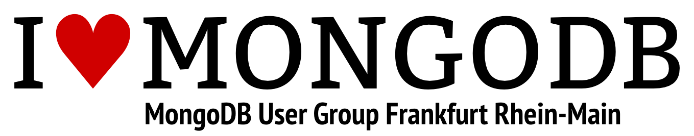

# MongoDB User Group Frankfurt Rhein-Main

Ziel dieser Gruppe ist der regelmäßige Informationsaustausch zwischen MongoDB-Usern aus dem Großraum
Frankfurt (und auch gerne darüber hinaus). Wir wollen im Rahmen einer Vortragsserie unsere MongoDB-Projekte
vorstellen, diskutieren und unsere Erfahrungen weitergeben.

## Links &amp; Kontakt

Homepage: <http://www.meetup.com/Frankfurt-Rhine-Main-MongoDB-User-Group/>

