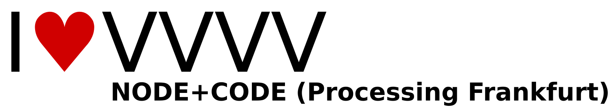

# NODE+CODE (Processing Frankfurt) (N+C)

NODE+CODE is a monthly meetup from the communities of VVVV, Processing and related frameworks. We are
interested in discussing what the things are and mean that we build with these frameworks (and other digital
means). Since late 2011 we regularly invite artists, thinkers, hackers, ..., to present their views or works and
to help us start new discussions and open new fields.

NODE+CODE is a cooperation between [basis Frankfurt](http://basis-frankfurt.de/) and [NODE Forum for Digital
Arts](http://node.vvvv.org/).

NODE+CODE is part of [Processing Cities](http://www.processingcities.org/).

## Links &amp; Kontakt

Homepage: <http://www.meetup.com/NODE-CODE-Frankfurt>

Twitter: [@p5v4ffm](https://twitter.com/@p5v4ffm)

Facebook: <https://www.facebook.com/pvvvv.frankfurt>

