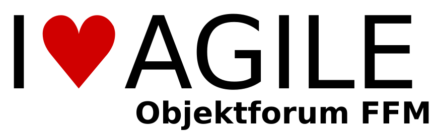

# Objektforum FFM (ObjektforumFFM)

Für Sie ist agile Softwareentwicklung nicht ausschließlich Scrum? Und Code-Qualität kein Luxus, sondern elementar? Dann finden Sie beim ObjektForum Frankfurt regelmäßig passende Themen und Zeit für den direkten Austausch mit anderen Entwicklerinnen und Entwicklern. Agile Software Engineering, Agile Projektmanagement und Agile Requirements Engineering sind die drei Themengebiete, über die wir beim ObjektForum reden. Miteinander und mit Referentinnen und Referenten, die ein bestimmtes Gebiet intensiv beleuchten.

Dazu kombiniert jedes ObjektForum Frankfurt einen Fachvortrag und die anschließende Diskussion der Teilnehmenden bei Getränken und Snacks. Die Teilnahme am ObjektForum ist kostenfrei. Wir spenden an die Frankfurter Tafel.

## Links &amp; Kontakt

Homepage: <https://www.andrena.de/objektforum-frankfurt>

Twitter: [@objektforum](https://twitter.com/@objektforum) [#objektforum](https://twitter.com/search?q=%23objektforum)

