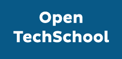

# OpenTechSchool RheinMain (OTSRM)

The RheinMain area is a huge area around Frankfurt where many web technology startups
        have their
        headquarters. Anyone coming from the area is welcomed to join OTS RheinMain! We want to connect the developers,
        designers and curious people in that area and share knowledge and expertise with them.

        **About OpenTechSchool**

        OpenTechSchool is a community initiative offering free programming workshops and meetups to technology
        enthusiasts of all genders, backgrounds, and experience levels. It supports volunteer coaches in setting up
        events by taking care of the organizational details, encouraging coaches to create original teaching material.
        This material is then openly shared online and can be further developed by contributions from the global OTS
        community. OTS’ main goal is to create a friendly learning environment where no one feels shy about asking any
        question. Everyone is invited to participate, whether as a coach or a learner, and get in contact to organize
        OTS events anywhere in the world.
    

## Links &amp; Kontakt

Homepage: <http://www.opentechschool.org/rheinmain/>

Twitter: [@OTS_RM](https://twitter.com/@OTS_RM)

Logo: [OpenTechSchool.org](http://www.opentechschool.org/handbooks/styles.html)

