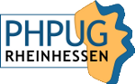

# PHP UG Rheinhessen (PHPUGRHH)

Die PHP User Group Rheinhessen ermöglicht den Austausch von Wissen und Erfahrungsberichten zum Thema PHP.
Wir organisieren Vorträge zu PHP- und anderen Themen. Jede/r Interessierte ist willkommen, sich miteinzubringen.

## Links &amp; Kontakt

Homepage: <http://www.phpug-rheinhessen.de/>

Twitter: [@phpugrhh](https://twitter.com/@phpugrhh) [#phpugrhh](https://twitter.com/search?q=%23phpugrhh)

Facebook: <http://www.facebook.com/group.php?gid=192655655785>

XING: <https://www.xing.com/net/pri3a328cx/phpugrhh/>

Das Logo stammt von UG-Mitglied [Lukas Giebel](https://plus.google.com/102794229174790604056/about)

