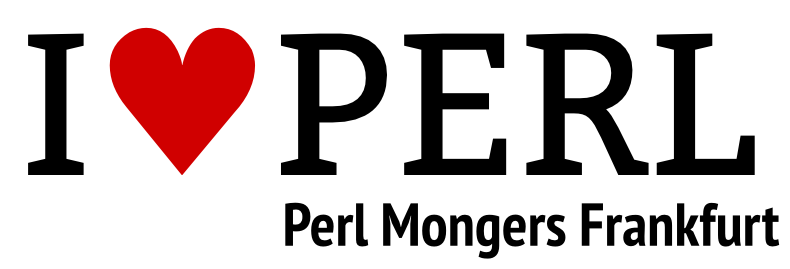

# Perl Mongers Frankfurt (Frankfurt.pm)

Frankfurt Perl Mongers sind Menschen, die sich mit der dynamischen Programmiersprache Perl beschäftigen
und gerne darüber reden.

Wir treffen uns seit dem Jahr 2000 ein Mal im Monat in lockerer Atmosphäre. Der
Schwerpunkt ist natürlich Perl, dennoch widmen wir uns auch Randgebieten und auch schon mal anderen
Programmiersprachen.

Wir richten uns an alle, die das Interesse haben, etwas mit Perl zu machen. Dabei spielt keine Rolle, ob
beruflich oder nur als "Hobby". Jeder ist willkommen, der auch nur einen Funken Interesse am Programmieren mit
Perl hat.

## Links &amp; Kontakt

Homepage: <http://frankfurt.pm/>

Mailingliste: <http://mail.pm.org/mailman/listinfo/frankfurt-pm?language=de>

