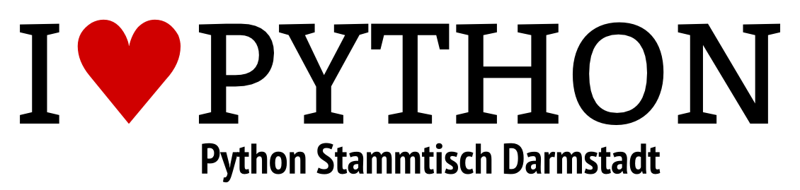

# Python Stammtisch Darmstadt (PyStaDa)

In Darmstadt gibt es seit Februar 2014 einen Stammtisch zum Thema Python.

	Wir verstehen uns als lockere Gemeinschaft, die sich zum Austausch über Projekte, Probleme und Ideen Rund um die Programmiersprache Python trifft. Der Plan ist immer mal wieder einen Vortrag über ein Python Projekt oder ein Software-Handwerks-Thema wie Version Control, Projektmanagement oder Ähnliches zu haben.

        Die Treffen finden alle zwei Wochen in der so genannten Trollhöhle statt und sind für alle Interessierten offen.
	Sie haben keine festgelegte Agenda, alles rund um Python geht.
	In Wochen in denen die [PyUGRM](http://usergroups.rheinmainrocks.de/~pyugrm) statt findet, fallen die Treffen aus.
    

## Links &amp; Kontakt

Homepage: <http://pystada.github.io/>

Twitter: [@PyStaDa](https://twitter.com/@PyStaDa) [#PyStaDa](https://twitter.com/search?q=%23PyStaDa)

Mailingliste: <https://lists.chaos-darmstadt.de/mailman/listinfo/pystada>

