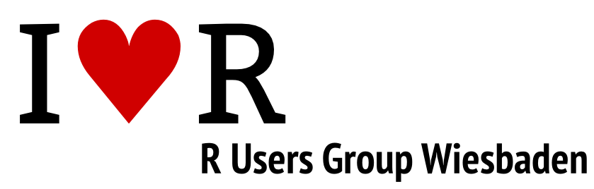

# R Users Group Wiesbaden

R ist ein äußerst flexibles Statistikprogramm mit einer sehr großen Anzahl von Funktionen, die durch
Pakete beliebig erweitert werden können. R entwickelt sich zunehmend zur Lingua France der
Statistik-Programmiersprachen. Weiter ist R ein Open Source Programm.

R erlaubt objektorientiertes Arbeiten und stellt eine Mischung aus Datenanalyse-Programm und Programmiersprache
dar, mit der das Programm durch eigene Funktionen beliebig erweitert werden kann. Dies macht R sehr flexibel.

Für alle mitgelieferten Funktionen ist der Source-Code verfügbar, so dass auch bestehende Funktionen modifiziert
werden können. Eigene C- und Java-Routinen können eingebunden werden.

Die Gruppe soll ein Forum für an R Interessierte aus Wissenschaft und Wirtschaft werden. Regelmäßige Meetings
sollen durchgeführt werden. Wenn möglich sollen Workshops zur Wissensvermittlung angeboten werden.

## Links &amp; Kontakt

Homepage: <http://www.meetup.com/Wiesbaden-R-Users-Group>

