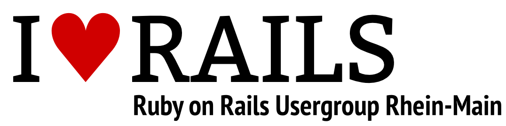

# Ruby on Rails Usergroup Rhein-Main (RUGRM)

Wir treffen uns einmal pro Monat, um gemeinsam über aktuelle Themen in der Web-Entwicklung zu sprechen und Erfahrungen auszutauschen.

## Links &amp; Kontakt

Homepage: <http://rug-rheinmain.de/>

