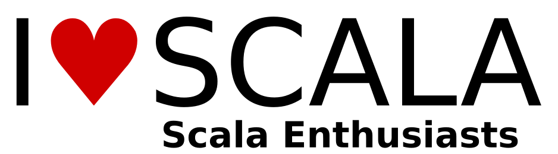

# Scala Enthusiasts

This meetup is actually more a meetup-to-be!

For the time being, its goal is to gauge the interest in Scala in the region of Darmstadt/Frankfurt and to find
out if there is enough interest to hold regular meetups to network and share knowledge on Scala and its
ecosystem.

There are many topics we could cover:

* Discovering the language itself (language constructs, core libraries, ...),
* Web frameworks (Play2, Lift, …)
* Akka,
* Typesafe stack,
* Functional programming principles,
* Study groups related to Coursera classes on FP and reactive programming,
* Study groups related to the book “functional programming in Scala” or scala koans,
* Experience and knowledge sharing from developers, startups or established entreprises,
* Job offers,
* scalaz and other hardcore stuff ;)
* … you name them

So whether you’re a beginner, a seasoned developer or a business person interested in Scala let me know!
Last but not least, I have yet no idea where to host the meetups and I am by no means an expert in Scala. So, if
you have connections with universities or companies that could provide a place that would be great and if you
have great ideas, want to give talks, want to be a co-organizer that would be fantastic.

## Links &amp; Kontakt

Homepage: <http://www.meetup.com/Darmstadt-Frankfurt-Scala-Enthusiasts/>

