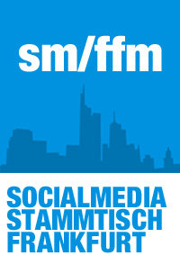

# Social Media Stammtisch Frankfurt (SM/FFM)

Neuste Trends und Erfahrungen um das Social Web werden ausgetauscht und wirtschaftlich, kulturell oder
auch philosophisch durchleuchtet. Alles eben, was den Social Media Profi interessiert. Ab und an werden
Impulsvorträge gehalten. Beim Social Media Stammtisch Frankfurt geht es seit April 2010 regelmäßig um neuste
Trends und Erfahrungen um das Social Web. Dabei werden wir das Thema möglichst breit diskutieren;
Wirtschaftlich, kulturell oder auch philosophisch. Alles eben, was den Social Media Profi interessiert. Ab und
an werden Impulsvorträge gehalten.

## Links &amp; Kontakt

Homepage: <https://www.facebook.com/socialmediafrankfurt>

Google+: <https://plus.google.com/102599953080163884985/posts>

Logo: [Facebook](https://www.facebook.com/socialmediafrankfurt).

