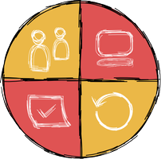

# Softwerkskammer Rhein-Main (SWKRM)

Wir sind eine Gruppe von Softwareentwicklern, die professionell Software entwickeln möchten.
Dazu tauschen wir Erfahrungen zu Themen wie Clean Code, Behaviour Driven Design, Test Driven Development,
Objekt-Orientiertem Design, Softwarearchitektur aber auch zu den sog. "Soft Skills" und den oft
vernachlässigten menschlichen Aspekten der Softwareentwicklung in einem Team.
Wir treffen uns durchschnittlich einmal im Monat wobei das stets wechselnde Rahmenthema für ein Treffen beim
vorherigen Treffen festgelegt werden.

## Links &amp; Kontakt

Homepage: <http://softwerkskammer.org/groups/rheinmain>

Twitter: [@softwerkskammer](https://twitter.com/@softwerkskammer) [#swkrm](https://twitter.com/search?q=%23swkrm)

