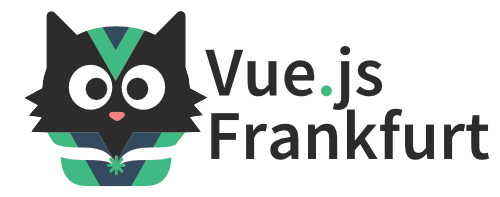

# Vue.js Frankfurt

Vue.js Frankfurt ist eine Meetup-Community für alle, die sich für Vue.js interessieren. Nimm an einer unserer Veranstaltungen teil, um unsere Community kennenzulernen. 

Unser Ziel: 

* Wir sind der zentrale Treffpunkt für alles rund um Vue.js im Rhein-Main-Gebiet und bereichern die Rhein-Main-Tech-Community.

* Wir sind eine unterstützende, inklusive und vielfältige Community, die jeden willkommen heißt, der sich für Vue.js interessiert, im Web gestaltet oder einfach nur ein Teil unserer Community sein möchte.

* Wir organisieren Veranstaltungen, die sich auf Vue.js bezogene Themen konzentrieren, in verschiedenen Formaten, einschließlich, aber nicht beschränkt auf Vorträge, Programmierabende und gesellschaftliche Ereignisse.

## Links &amp; Kontakt

Homepage: <https://www.vuejsfrankfurt.de/>

