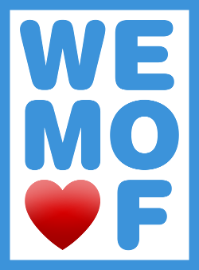

# Webmontag Offenbach (WEMO♥F)

Der Webmontag Offenbach bringt Menschen zusammen, die sich für das Web begeistern, Teil davon sind oder
es werden wollen.

In Offenbach fehlt eine regelmäßige, durch die Community organisierte
Veranstaltung, die Interessierte aus allen kreativen Branchen
zusammenbringt und so die Raum für neue Verbindungen und Synergien
schafft. Ein Webmontag bietet hierfür den idealen Rahmen, da das
Internet ist ohne Zweifel das Leitmedium der kreativen Wirtschaft
geworden ist und sich viele Menschen mit den Grundprinzipien des Webs
identifizieren können: Offenheit, Transparenz und Freiheit. Ich bin
überzeugt, dass Offenbach diese Veranstaltung braucht und glaub daran,
dass wir als kreative Gemeinschaft den Termin in den nächsten Wochen
realisieren können.

## Links &amp; Kontakt

Homepage: <http://wemoof.de/>

Twitter: [@wemoof](https://twitter.com/@wemoof) [#wemoof](https://twitter.com/search?q=%23wemoof)

Facebook: <https://www.facebook.com/pages/wemoof/435444859870520>

