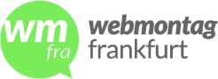

# Webmontag Frankfurt (WMFRA)

Der Webmontag Frankfurt bringt Anwender, Entwickler, Gründer, Unternehmer, Venture Capitalists,
Forscher, Web-Pioniere, Blogger, Podcaster, Designer und sonstige Interessenten zum Thema Web 2.0 zusammen. Die
Veranstaltung ist kostenlos und findet immer am 2. Montag im Monat statt.

## Links &amp; Kontakt

Homepage: <http://www.wmfra.de/>

Twitter: [@wmfra](https://twitter.com/@wmfra) [#wmfra](https://twitter.com/search?q=%23wmfra)

Facebook: <http://www.facebook.com/wmfra>

Google+: <https://plus.google.com/110561795970285494597>

