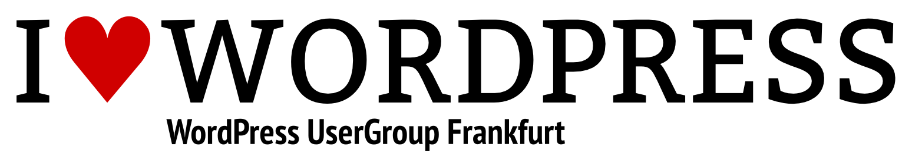

# WordPress UserGroup Frankfurt (WPUGFFM)

Die Treffen sollen grundsätzlich zwei Gruppen ansprechen: Blogger, Publisher und Nutzer von WordPress
(.org und .com), und Programmierer, Plugin- und Theme-Entwickler.
In einem allgemeinen Teil können die neuesten Entwicklungen rund um WP, die schönsten Themes und
interessantesten neuen Plugins von den Usern vorgestellt werden, sowie Fragen in die Runde gestellt werden.
Im zweiten Teil geht es ans Eingemachte, nämlich praktisches Lernen des Umgangs mit WP. Für die User &
Anfänger geht es von der Entscheidung ob gehostet oder selber installiert über die Einrichtung zum ersten Post.
In späteren Treffen geht es um den Betrieb, Best Practices, SEO und alles, was dazu gehört.

Die Entwickler lernen worauf es bei der Erstellung eines Plugins oder Themes ankommt, was möglich ist, und wie
man es am besten macht.

Die Treffen sollen aufeinander aufbauen und beginnen mit zunächst mit den Basics. Solltest du mit WP erfahren
sein, oder sogar schon dafür entwickelt haben, komm einfach bei den späteren Treffen dazu, um nicht zu lernen,
wie man WordPress installiert. Wir werden die Agenda immer im Vorfeld posten, so dass jeder weiß, was sie/ihn
erwartet.

## Links &amp; Kontakt

Homepage: <http://wpug.die-zentrale-ffm.de/>

